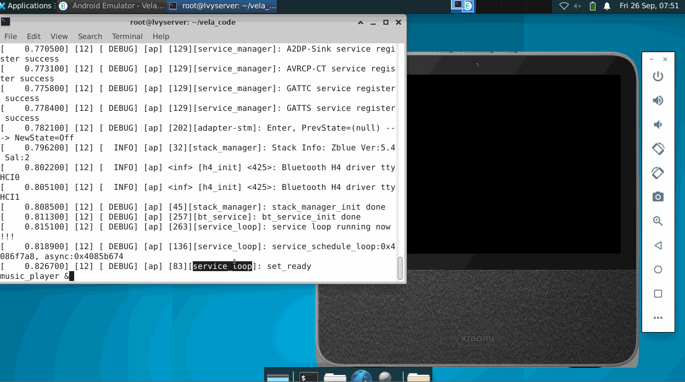

<div align="center">

# **基于 openvela 系统的音乐播放器**

[](https://openvela.org)
[](https://lvgl.io)
[](LICENSE)
[](music_player2/docs/ch/CHANGELOG.md)



</div>

## 快速开始

```bash
# 一键启动（推荐）
./scripts/run_music_player_gui.sh

# 手动构建
./build.sh vendor/openvela/boards/vela/configs/goldfish-armeabi-v7a-ap -j8
./emulator.sh vela && adb push music_player2/res /data/ && adb shell "music_player2 &"
```

## 技术特性

- **系统平台**：openvela/NuttX 嵌入式系统
- **图形界面**：LVGL 9.x，32位色深渲染
- **架构设计**：模块化设计，6个独立模块，事件驱动

## 文档导航

| 语言 | 完整文档 | 技术架构 | 故障排除 | 更新日志 |
|------|----------|----------|----------|----------|
| 🇨🇳 中文 | [README](music_player2/README.md) | [架构设计](music_player2/docs/ch/TECHNICAL.md) | [问题解决](music_player2/docs/ch/TROUBLESHOOTING.md) | [版本历史](music_player2/docs/ch/CHANGELOG.md) |
| 🇺🇸 English | [README](music_player2/README-en.md) | [Architecture](music_player2/docs/en/TECHNICAL.md) | [Troubleshooting](music_player2/docs/en/TROUBLESHOOTING.md) | [Changelog](music_player2/docs/en/CHANGELOG.md) |

## 开源协议

本项目采用 [Apache License 2.0](LICENSE) 开源协议  
欢迎提交 Issue 和 Pull Request 贡献代码
